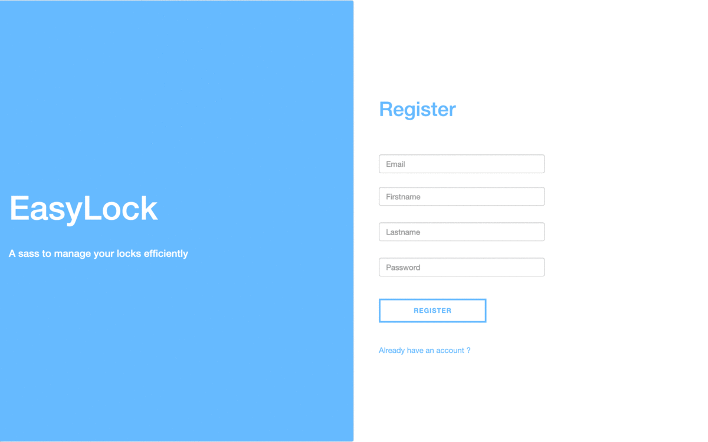

# EasyLock

EasyLock is a SaaS solution to manage your locks. It uses facial recognition.

**Demo**

**How it works**

- Create a new account and upload at least 5 pictures of you
- Wait to be invited on a lock or create your own lock
- Invite people on your lock by entering their email address
- Set an expiration date for the invitation
- Check who can open your lock by sending profile pictures

**Frontend**

* [React](https://github.com/facebook/react)
* [Babel](http://babeljs.io) for ES6 and ES7 magic
* [Webpack](http://webpack.github.io) for bundling
* [Redux](https://github.com/reactjs/redux) Predictable state container for JavaScript apps

**Backend**

* [Django](https://www.djangoproject.com/)
* [Django REST framework](http://www.django-rest-framework.org/) A powerful and flexible toolkit for building Web APIs
* [Django REST Knox](https://github.com/James1345/django-rest-knox) Token based authentication for API endpoints

## Installation

I use Docker as a development environment.

Install [Docker](https://www.docker.com/products/overview) and [Docker Compose](https://docs.docker.com/compose/install/).

To launch the development server

* `$ docker-compose build`
* `$ docker-compose up`

To stop the development server:

* `$ docker-compose stop`

Stop Docker development server and remove containers, networks, volumes, and images created by up.

* `$ docker-compose down`

You can access shell in a container

* `$ docker ps`
* `$ docker-compose exec api bash`

## Access web app

Just go to http://localhost:81